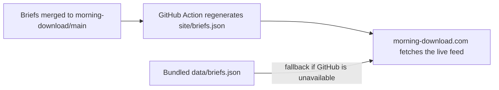

# Morning Download website

Source code for [morning-download.com](https://morning-download.com/), a fast, searchable reader for Andrew Coomes's daily Morning Download briefings.

The editorial content is maintained separately in [`acoomes/morning-download`](https://github.com/acoomes/morning-download). This repository owns the reader experience, styling, bundled fallback data, tests, and Sites deployment configuration.

## How it works



The client checks the public feed on page load with a five-minute cache window. Newly merged briefings therefore appear without rebuilding this website. If the request fails, readers continue to see the 30 most recent bundled editions.

## Local development

Requirements: Node.js 22.13 or newer.

```bash
npm install
npm run dev
```

Then open the local URL printed by vinext.

Useful checks:

```bash
npm run lint
npm test
npm run build
```

## Repository map

| Path | Purpose |
| --- | --- |
| `app/MorningDownload.tsx` | Reader behavior, archive search, live-feed loading, and fallback logic |
| `app/globals.css` | Complete visual system and responsive layout |
| `app/page.tsx` | Home route and page metadata |
| `data/briefs.json` | Recent 30-edition fallback used when the live feed is unavailable |
| `tests/rendered-html.test.mjs` | Rendered-output smoke tests |
| `scripts/generate-briefs.mjs` | Local utility for rebuilding fallback data from an adjacent content checkout |
| `.openai/hosting.json` | Existing OpenAI Sites project binding; contains no secret credentials |
| `worker/index.ts` | Cloudflare-compatible server entrypoint |

See [`AGENTS.md`](./AGENTS.md) for change boundaries, traversal guidance, and the required validation sequence.

## Content updates

Do not add daily briefings here. Add or correct Markdown in [`acoomes/morning-download`](https://github.com/acoomes/morning-download). Its `Publish site briefing feed` workflow updates the JSON consumed by this application.

Only refresh `data/briefs.json` when you intentionally want to advance the 30-edition offline/degraded-mode snapshot. The normal live path does not require a commit or deployment in this repository.

## Deployment

Production is hosted with OpenAI Sites and attached to `morning-download.com`. Build successfully before publishing. Agents that support Sites should reuse the project ID in `.openai/hosting.json`, save a new version from the exact pushed commit, and deploy that saved version. Never create a replacement Sites project for routine updates.

No repository or runtime secrets are required for the public briefing feed.
